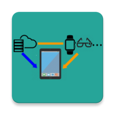
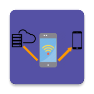

# MPBond

<div align="center">
  
  &nbsp;&nbsp;&nbsp;&nbsp;&nbsp;&nbsp;&nbsp;&nbsp;&nbsp;&nbsp;&nbsp;&nbsp;&nbsp;&nbsp;&nbsp;&nbsp;&nbsp;&nbsp;&nbsp;&nbsp;&nbsp;
  
</div>

## Introduction
<b>MPBond</b> is an efficient system allowing multiple personal mobile devices to collaboratively fetch content from the Internet, used in our MobiSys'20 paper: [**MPBond: Efficient Network-level Collaboration Among Personal Mobile Devices**](https://xiaoshawnzhu.github.io/mobisys20-mpbond.pdf). 

MPBond consists of primary, helper and proxy parts.  

When you use MPBond in any publications, please refer our work in the following format.
```
Xiao Zhu, Jiachen Sun, Xumiao Zhang, Yihua Ethan Guo, Feng Qian, and Z.Morley Mao. 
2020. MPBond: Efficient Network-level Collaboration Among Personal Mobile Devices. 
In The 18th Annual International Conference on Mobile Systems, Applications, and Services (MobiSys ’20), ACM.
```

If you have any questions about how to use the code, please contact me (shawnzhu@umich.edu).